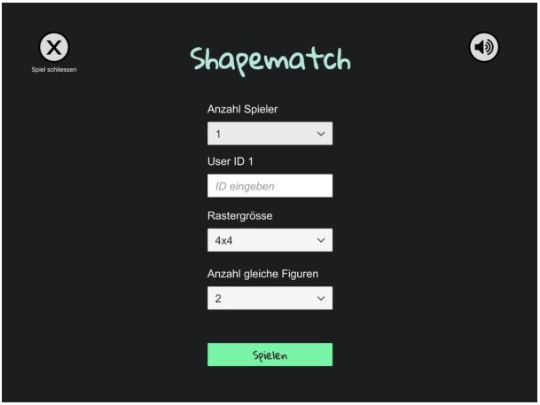

# Game for collecting and analyzing user touch gestures
This project is split into two parts: The first one consists of a game developed in unity which is primarly
intended to collect players’ screen touches in JSON format. The second part consists of a python script for the analysis of the collected data and a dataset of 193910 screen touch points that represent different touch trajectories performed by 15 participants (between 12 and 92 years old) by playing the Shapematch game

## Part 1: Game for screen touch data collection (Shapematch)

ShapeMatch is a single and multiplayer game with the purpose of collecting their touch gestures. The objective from the player's perspective is,
through touch gestures, to join as many equal figures shown in a grid in the shortest possible time.

### System requirements
| Technology/Device | Version/model |
|---|---|
| C# | 7.3 |
| Unity | 2019.1.0f2 |

### Game Scenes
#### Configuration

<small>Illustration of the initial configuration scene containing a series of dropdown menus and text fields with
which the player determines the way he wants to play the game round</small>

<small>Illustrations of the Grid scene. The image on the left (a) simulates a touch gesture movement in which two
       figures of the same type are connected. The grey line is created once the player touches a figure and keeps moving
       his finger along the screen creating an independent trajectory. The image on the right (b) is the result of joining two
       figures of the same type in which both figures disappear. Note that now the player has received two points equivalent to the two figures joined together. </small>

<small>Illustrates the paused game scene in which the player can continue with the game round or return to the
       initial setup scene</small>

### Simplified JSON Structure of the collected data during a game round (ignore '//' comments)
```json {r error=TRUE}
{
 "id": 2, // the game round id
 "userData": {
 "uid1": "unbekannt",
 "uid2": ""
 },
 "score": {
 "matchedFigures": 2, // the total number of paired figures
 "time": { // start and end of the game round in unix milliseconds
"initialTime": 1561813049324,
 "finalTime": 1561813121469
 },
 "gridSize": "4x4", // 4 columns x 4 rows
 "numberOfPlayers": 1
 },
 "touchDataList": { // contains two lists of trajectories. Each trajectory is a list of
points
 "matched": [ // list of trajectories (each trajectory is a list of points) of matched figures
 {
 "points": [ // the points list contains the points belonging to a trajectory
 {
 "deltaTime": 7.554210662841797, // time elapsed since the start of the game
in which the point was created
 "x": 0.7624450922012329, // normalised position on the x-axis obtained by dividing the original position in pixels by the width of the screen
 "y": 0.6103515625
 }],
 "sameFigures": [ // it always contains the 2 or 4 figures paired by the trajectory
 {
 "x": 0.24444301426410676,
 "y": 0.8409090638160706,
 "deltaTimeMatch": 8.821630477905274 // time elapsed when the figure was
matched
 }]
 }],
 "unmatched":[ // This list is analogous to that of the matched
 {
 "points": [
 {
 "deltaTime": 72.12589263916016,
 "x": 0.9194729328155518,
 "y": 0.50341796875
}],
 "sameFigures": []
 }]}}

```
### Main components of the Unity project


#### Description of the relationship between components in a real case scenario
When the player fills in the input fields in the initial configuration scene and clicks the
"Starten" button, the input data is stored in the GameController class and the Grid
scene is loaded. The values stored in the GameController are accessed by the Grid and LineController classes which are instantiated with the scene change. The Grid
class has as its attribute a two-dimensional array of the GamePiece object which contains the figures to be displayed in the Grid. The LineController class creates an instance of the DrawLine class creating a visible line every time the player touches a GamePiece with his finger and moves his finger without removing it along the screen.
The OnlineCollider class observes the collisions between the created line and each
GamePiece, when the user joins with the line the number of GamePieces of the same
type to join (2 or 4) these are recycled by the GameObjectUtil class, that is to say, they
go to "inactive" state instead of being destroyed and disappear from the screen. Finally
each inactive GamePiece is enabled again when the Grid becomes empty and is refilled as shown in Figure 2.a and Figure 2.b. 

## Part 2 - Data analysis
Contains a python script including different methodos for data analysis

### System requirements
| Technology | Version |
|---|---|
| Python | 3.7 |
| Anaconda | 2019.10 |

### Definition of trajectory, point, sequence and time series terms


<small>Plot of one dimensional time series corresponding to the positions of the vertical displacements (y-axis)
       of two different trajectories</small>

### Listing and grouping of trajectories according to paired figure positions

The trajectories of all the game rounds are grouped according to the position
of the figures paired in each of them. The trajectories will be listed containing the
following information:

|Group id|Uid1|Uid2|X|Y|
|---|---|---|---|---|
|Group to which the trajectory pertains according to the position of the paired figures.|id for the user 1 who played the game round converted into a unique integer|id for the user 2 who played the game round converted into a unique integer| Array of positions on the xaxis of the trajectory points | Array of positions on the y-axis of the trajectory points|


<small> Illustration of figures that appear in the same position of the grid. The trajectories that match these figures belong to the same group</small>
